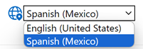

# Blazor localization steps
## Overview
Localization is an essential aspect of modern web applications, enabling them to support multiple languages and regions. We will try to use the most complicated example where we have client and server working together. We try to follow [MS Recommendation](https://learn.microsoft.com/en-us/aspnet/core/blazor/globalization-localization?view=aspnetcore-8.0).

## Create a Shared Project for Resources

Create a new class library project, e.g., SharedResources, to hold your resource files. This project will be referenced by both the client and server projects.


1. Server project must point to the SharedResources project (3)
1. Client project must point to the SharedResources project (3)

Ensure that the Microsoft.Extensions.Localization package is included in all projects.

## Add Resource Files

Add your resource files to the Resources folder in the SharedResources project.
The default resource file can be SharedLocalizer.resx (for the default culture), and you can add culture-specific variants such as SharedLocalizer.es-MX.resx. Add any example for translation to resources.


Create the SharedLocalizer class (A) in the SharedResources project. This class will be used to access the localized strings. It is important that the resource names B,C have the same name as A.

```csharp
using Microsoft.Extensions.Localization;

namespace Netlify.SharedResources
{
    public class SharedLocalizer
    {
        private readonly IStringLocalizer<SharedLocalizer> _localizer;

        public SharedLocalizer(IStringLocalizer<SharedLocalizer> localizer)
        {
            _localizer = localizer;
        }

        public string this[string key] => _localizer[key];
    }
}
```

## Add extension method

Create the SharedLocalizerExtension class in the SharedResources project. This class provides an extension method to add localization services and a method to get supported cultures.

```csharp
using Microsoft.Extensions.DependencyInjection;

namespace Netlify.SharedResources;

public static class SharedLocalizerExtension
{
    public static void AddSharedLocalization(this IServiceCollection services)
    {
        services.AddLocalization(options => options.ResourcesPath = "Resources");
        services.AddTransient<SharedLocalizer>();
    }
}
```
## Add language desription

```csharp
using System.Globalization;

namespace Netlify.SharedResources;

public static class SharedLocalizerHelper
{
    // Define supported cultures and their descriptions
    private static readonly Dictionary<string, string> SupportedCultures = new()
                                                                               {
                                                                                   { "en-US", "English (United States)" },
                                                                                   { "es-MX", "Spanish (Mexico)" }
                                                                               };
    public static CultureInfo[] GetSupportedCultures()
    {
        var cultures = new List<CultureInfo>();
        foreach (var culture in SupportedCultures.Keys)
        {
            cultures.Add(new CultureInfo(culture));
        }
        return cultures.ToArray();
    }

    public static Dictionary<string, string> GetCulturesDescription()
    {
        return new Dictionary<string, string>(SupportedCultures);
    }
}
```


## Configure the Server Project

### Add a Reference to the Shared resources Project.   

In the Blazor Server project, add a reference to the SharedResources project.

### Add extension class

```csharp
using Netlify.Middlware;
using Netlify.SharedResources;

namespace Netlify
{
    public static class ServerLocalizerExtension
    {
        public static void AddSharedLocalization(this WebApplication app)
        {
            var supportedCultures = SharedLocalizerExtension.GetSupportedCultures();

            var localizationOptions = new RequestLocalizationOptions()
                .SetDefaultCulture(supportedCultures[0])
                .AddSupportedCultures(supportedCultures)
                .AddSupportedUICultures(supportedCultures);

            app.UseRequestLocalization(localizationOptions);

            app.UseMiddleware<CultureMiddleware>();
        }
    }
}

```
### Configure Localization Services.
  In Program.cs or Startup.cs of the Blazor Server project, configure the localization services to use the resources from the SharedResources project.

 Startup.cs (Blazor Server)


```csharp
public void ConfigureServices(IServiceCollection services)
{
   services.AddSharedLocalization();
   ...
}

public void Configure(IApplicationBuilder app, IWebHostEnvironment env)
{
    if (env.IsDevelopment())
    {
    ...
    }
    else
    {
        app.UseExceptionHandler("/Error");
        app.UseHsts();
    }

     app.AddSharedLocalization();
     ...
}
```
### Create a Localization Controller

```csharp
using Microsoft.AspNetCore.Localization;
using Microsoft.AspNetCore.Mvc;

namespace Netlify.Controllers;

[Route("[controller]/[action]")]
public class CultureController : Controller
{
    public IActionResult Set(string culture, string redirectUri)
    {
        if (culture != null)
        {
            var cookieOptions = new CookieOptions
                                    {
                                        Expires = DateTimeOffset.UtcNow.AddYears(1) // Set a long expiration time
                                    };
            string cookieValue = CookieRequestCultureProvider.MakeCookieValue(new RequestCulture(culture, culture));
            HttpContext.Response.Cookies.Append(
                CookieRequestCultureProvider.DefaultCookieName,
                cookieValue,
                cookieOptions);
        }

        return LocalRedirect(redirectUri);
    }
}
```
### Create middleware
Middleware to set the culture based on user preferences or request

```csharp
using Microsoft.AspNetCore.Localization;
using System.Globalization;

namespace Netlify.Middlware;

public class CultureMiddleware
{
    private readonly RequestDelegate _next;

    public CultureMiddleware(RequestDelegate next)
    {
        _next = next;
    }

    public async Task InvokeAsync(HttpContext httpContext)
    {
        var requestCookie = httpContext?.Request.Cookies[CookieRequestCultureProvider.DefaultCookieName];
        if (requestCookie != null)
        {
            var cultureResult = CookieRequestCultureProvider.ParseCookieValue(requestCookie);
            if (cultureResult != null && cultureResult.Cultures.Any())
            {
                var currentCulture = cultureResult.Cultures[0];
                CultureInfo cultureInfo = new CultureInfo(currentCulture.ToString());
                CultureInfo.CurrentCulture = cultureInfo;
                CultureInfo.CurrentUICulture = cultureInfo;
            }
        }
        await _next(httpContext);
    }
}

```

## Configure the Client Project

### Add a Reference to the Shared Project
In the Blazor WebAssembly client project, add a reference to the SharedResources project.

### Add Extension class. 

Need for language switching along with Java script added to server project.

```csharp
using System.Globalization;

using Microsoft.AspNetCore.Components.WebAssembly.Hosting;
using Microsoft.JSInterop;

namespace Netlify.Client;

public static class ClientLocalizerExtension
{
    public static async Task AddSharedLocalization(this WebAssemblyHost host, string defaultCulture)
    {
        var js = host.Services.GetRequiredService<IJSRuntime>();
        var result = await js.InvokeAsync<string>("blazorCulture.get");
        var culture = CultureInfo.GetCultureInfo(result ?? defaultCulture);

        if (result == null)
        {
            await js.InvokeVoidAsync("blazorCulture.set", defaultCulture);
        }

        CultureInfo.DefaultThreadCurrentCulture = culture;
        CultureInfo.DefaultThreadCurrentUICulture = culture;
    }
}

```
### Configure Localization Services

  In Program.cs of the Blazor WebAssembly project, configure the localization services to use the resources from the SharedResources project.

  Program.cs (Blazor WebAssembly)

```csharp
 var builder = WebAssemblyHostBuilder.CreateDefault(args);

 var services = builder.Services;
 services.AddAuthorizationCore();

 services.AddSharedLocalization();// Configure localization services

 var host = builder.Build();

 await host.AddSharedLocalization("en-US");// Configure localization services

 await host.RunAsync();

```
### Language selection component

```csharp
@using System.Globalization
@using Netlify.SharedResources
@inject IJSRuntime JS
@inject NavigationManager Navigation

<div style="display: flex;justify-content: center; align-items: center; ">
    @Label <FluentIcon Value="@(new Icons.Regular.Size24.GlobeLocation())" Color="@IconColor" Style="margin-top: 0px"/>
    <select id="lang-select" @bind="@selectedCulture" @bind:after="ApplySelectedCultureAsync">
        @foreach (var culture in supportedCultures)
        {
            <option value="@culture">@cultureDict[culture.Name]</option>
        }
    </select>

</div>

@code
{
    [Parameter]
    public string? Label { get; set; }
    
    [Parameter]
    public Color? IconColor { get; set; }

    private Dictionary<string, string> cultureDict = SharedLocalizerHelper.GetCulturesDescription();
    
    private CultureInfo[] supportedCultures = SharedLocalizerHelper.GetSupportedCultures();

    private CultureInfo? selectedCulture;

    protected override void OnInitialized()
    {
        selectedCulture = CultureInfo.CurrentCulture;
    }

    private async Task ApplySelectedCultureAsync()
    {
        if (CultureInfo.CurrentCulture != selectedCulture)
        {
            await JS.InvokeVoidAsync("blazorCulture.set", selectedCulture!.Name);

            var uri = new Uri(Navigation.Uri)
                .GetComponents(UriComponents.PathAndQuery, UriFormat.Unescaped);
            var cultureEscaped = Uri.EscapeDataString(selectedCulture.Name);
            var uriEscaped = Uri.EscapeDataString(uri);

            Navigation.NavigateTo(
                $"Culture/Set?culture={cultureEscaped}&redirectUri={uriEscaped}",
                forceLoad: true);
        }
    }
    }
```
### Language selection component call example
Call with text and white colored icon
```razor
<CultureSelector Label="Select your locale:" IconColor="Color.Fill" @rendermode="InteractiveAuto" />
```
Simple call without text
```razor
<CultureSelector @rendermode="InteractiveAuto" />
```



## Use the Localizer in Components

Inject the SharedLocalizer into your Blazor components and use it to access localized strings.

ExampleComponent.razor (in Client project)

```razor

@page "/example"
@inject SharedLocalizer Localizer

<h1>@Localizer["HelloWorld"]</h1>
```

ExampleComponent.razor (in Server project)

```razor

@page "/example"
@inject SharedLocalizer Localizer

<h1>@Localizer["HelloWorld"]</h1>
```
