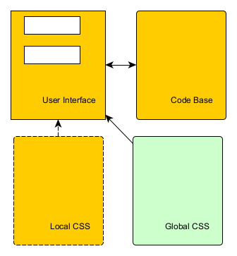
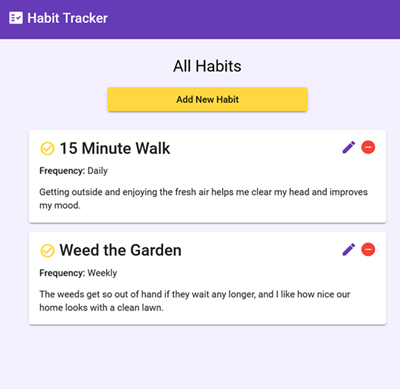
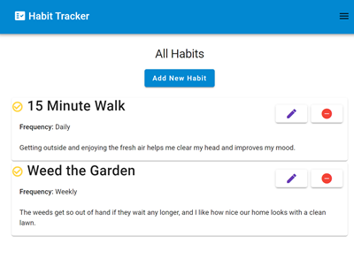
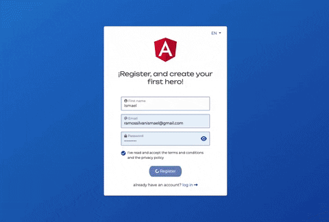

# Angular to Blazor Conversion Example

## Overview

This guide focuses on the process of converting an existing Angular application into a Blazor application. It will not delve into which framework is better for your specific needs—Angular or Blazor—but will provide practical insights into the conversion process.

### Common Challenges

When converting from Angular to Blazor, you may encounter several challenges:

- **Different UI Library**: You will need to select a new UI library for Blazor that offers similar controls to those used in your Angular application. This might involve finding Blazor components that match the functionality and aesthetics of your existing Angular components.

- **Different Page Rendering and User Experience**: Achieving a seamless user experience similar to that of your Angular application can be challenging. Blazor and Angular have different rendering mechanisms and lifecycle events, which may impact how users interact with your application.

- **Converting the Main Application**: While converting components is a crucial part of the process, you will also need to consider general tips and best practices for converting the overall application architecture and logic.

For detailed guidance on Blazor-specific topics, including localization, you can refer to the [Blazor Localization Guide](Docu/Localization.md).

## Conversion Tips

### 1. **Selecting a UI Library**

- **Identify Key Components**: List the key components used in your Angular application and find equivalent components in Blazor. Libraries like [Radzen Blazor](https://www.radzen.com/blazor/components/), [DevExpress Blazor](https://www.devexpress.com/blazor/), and [Syncfusion Blazor](https://www.syncfusion.com/blazor-components) offer extensive collections of UI controls.

- **Consistency**: Ensure that the new UI library supports responsive design and provides similar styling options to maintain consistency in user experience.

### 2. **Page Rendering and User Experience**

- **Understand Blazor’s Lifecycle**: Familiarize yourself with Blazor’s component lifecycle and rendering model. Blazor uses a component-based architecture where components are rendered on the client-side (Blazor WebAssembly) or server-side (Blazor Server).

- **Manage State**: Blazor provides various ways to manage state, including cascading parameters, dependency injection, and state containers. Adapt your Angular state management strategy to fit Blazor’s model.

- **Performance Optimization**: Blazor’s performance may differ from Angular’s. Optimize your Blazor application by leveraging features like async data loading, component reusability, and efficient state management.

### 3. **General Conversion Tips**

- **Component Conversion**: Convert Angular components to Blazor components (.razor files). Pay attention to data binding, event handling, and component interaction.

- **Routing**: Adapt Angular routing to Blazor routing. Blazor uses a different routing model, and you’ll need to update your route configurations accordingly.

- **Service Integration**: Replace Angular services with Blazor services. Ensure that your dependency injection setup in Blazor is configured to match the services used in your Angular application.

- **Testing**: Thoroughly test your Blazor application to identify and resolve any issues related to functionality, performance, and user experience.

By addressing these challenges and following best practices, you can effectively transition from Angular to Blazor, leveraging the strengths of both frameworks to build a robust and modern web application.


## General information

### Blazor render modes

Starting with .NET version 8, blazor has 4 application rendering modes:
- Static Server. Static server-side rendering (static SSR), non interactive
- Interactive Server. Interactive server-side rendering (interactive SSR) using Blazor Server.
- Interactive WebAssembly. Client-side rendering (CSR) using Blazor WebAssembly.
- Interactive Auto.	Interactive SSR using Blazor Server initially and then CSR on subsequent visits after the Blazor bundle is downloaded.

> See More: [ASP.NET Core Blazor render modes](https://learn.microsoft.com/en-us/aspnet/core/blazor/components/render-modes?view=aspnetcore-8.0), [Blazor hosting models (Blazor in .NET 8: Full stack Web UI )](https://chrissainty.com/blazor-in-dotnet-8-full-stack-web-ui/), [Blazor Render Modes in .NET 8](https://dvoituron.com/2024/01/23/blazor-render-modes/)

Streaming rendering is a small enhancement over SSR. It allows pages that need to execute long running requests to load quickly via an initial payload of HTML. 

> See more: [Components streaming rendering](https://learn.microsoft.com/en-us/aspnet/core/blazor/components/rendering?view=aspnetcore-8.0#streaming-rendering), [Blazor in .NET 8: Server-side and Streaming Rendering](https://chrissainty.com/blazor-in-dotnet-8-server-side-and-streaming-rendering/)
> If you are unsure, select Interactive Auto mode because Interactive WebAssembly, similar to Angular client-side rendering, has some drawbacks.

### Angular render modes
By default, Angular uses client-side rendering (CSR).
From angular version 16 it is possible to use Server Side rendering (SSR): [Angular server-side rendering](https://angular.dev/guide/ssr)

### Component structure
The component structure is the same for both languages:  



| Part | Angular | Blazor |
|--------|---------|--------|
| User Interface |HTML template, component.html |component.razor |
| Code base       |TypeScript class, component.ts | components.razor.cs |
| Local CSS styles | CSS styles, component.css |component.razor.css |

> **Note:** It is also possible to include a code-behind section in the Razor file, which is not recommended for large components.

## Example 1 - Habit Tracker
I was looking for an Angular code example with description and source code and found this:
[Learn Angular Basics by Building a Simple App Using Angular Material](https://betterprogramming.pub/learn-angular-basics-by-building-a-simple-app-using-angular-material-9bbc19aa33cf)

[Running example with source code](https://stackblitz.com/edit/habit-tracker-basic)


But first we need to run Angular project locally and update used Angular version 9, to the current version 18.
You can see how quickly the Angular version has changed. In 2020 was Angular version 9, In 2024 Angular version 18. See [Angular Update Guide](https://angular.dev/update-guide/)

For the Blazor version, I decided not to use a 100% visual copy. And replace edit icons to buttons.


### Conversion steps
1. Select the Blazor UI library best suited for your existing Angular application. I used Blazorise.
1. Create initial Blazor application. I used NET. 8 Wizard wirh Auto mode rendering.
1. First we need to convert single typescript files to charp. Sometimes it is possible to use free online conversion tool, for example : [Convertor ts -> C# 1](https://www.codeconvert.ai/typescript-to-csharp-converter), [Convertor ts -> C# 2](https://products.codeporting.app/convert/ai/typescript-to-csharp/)
1. Create empty Razor pages/components with similar names to existing Angular pages/components. We could use razor file, cs file and css file.
1. Copy angular .html to razor, convert .ts to c#, copy .css
1. Customize Angular component to match existing UI component. `button`--> `Button`
 - not recommended to use **for** loop conversion
 
  ```html
@for (habit of habits; track habit; let i = $index) 
  {
  
  }
```
```C#
@for (var i = 0; i < habits.Length; i++)
{
    var habit = habits[i];
    // code block
}
```
better to use **foreach** instead

  ```C#
 @foreach (var habit in Habits)
 {

 }
  ```
  
  And yes, the whole logic has to be changed, see example code.
## Example 2 - Netlify 
Login: test@google.com
[Second example](https://github.com/Ismaestro/angular-example-app) must be a bit complicated.
We can find there GraphQL Api call, authentication and localization.

[Working Angular App](https://angular-example-app.netlify.app/)  


### Conversion steps
- For this example, we will choose MS FluentUI
- For localization, we will follow [MS Recommendation](https://learn.microsoft.com/en-us/aspnet/core/blazor/globalization-localization?view=aspnetcore-8.0).
  For web assembly language setting stored in local storage and for the server in cookie via controller.
  In general, in our case it will be enough to use the cookie to store the language setting. But we leave both local settings and internal storage for learning case.
  But we keep both the cookie and local storage for learning purposes. [See more](Docu/Localization.md)


## Blazor UI Library
- [Radzen Blazor Components - free](https://blazor.radzen.com/) A set of 80+ free and open source native Blazor UI controls.
- [MudBlazor - free](https://mudblazor.com/) Blazor Component Library based on Material design with an emphasis on ease of use. Mainly written in C# with Javascript kept to a bare minimum it empowers .NET developers to easily debug it if needed. 
- [Blazorise - limited free](https://blazorise.com/) Blazorise consists of modern UI components with customizable styling, comprehensive documentation, UI design assets, and the tooling you need to build a solid foundation for your applications. Support CSS framework independent development in C# (Fluent2, Tailwind, Bootstrap4-6, Bulma, Material)
- [MS Fluent UI - free](https://github.com/microsoft/fluentui-blazor) Microsoft Fluent UI Blazor components library. For use with ASP.NET Core Blazor applications 
- [Blazored - free](https://github.com/Blazored) A collection of components and libraries for Blazor. Local Storage, Session Storage, Modalm Toast, Fluent Validation, Typeahead.
- [MatBlazor - free](https://www.matblazor.com/) Material Design components for Blazor. last changes 2021 .NET 6.0
- [Ant Design Blazor - free](https://antblazor.com) A rich set of enterprise-class UI components based on Ant Design and Blazor
- [BlazorStrap - free](https://blazorstrap.io/) Bootstrap 4/5 Components for Blazor Framework.

- [Telerik](https://www.telerik.com/blazor-ui) Develop new Blazor apps and modernize legacy web projects in half the time with a high-performing Grid and 110+ truly native, easy-to-customize Blazor UI components. Design and productivity tools are also included. 
- [Developer Express](https://www.devexpress.com/blazor/) Blazor UI Component Library ships with a comprehensive set of native Blazor components (including a DataGrid, Pivot Grid, Scheduler, Chart, Data Editors, and Reporting).
- [Syncfusion](https://www.syncfusion.com/blazor-components) The Syncfusion Blazor component library offers 85+ responsive, lightweight components, including data visualizations like DataGrid, 50+ Charts, and Scheduler, for building modern web apps. 

YouTube Video - [8 Free and Open Source Blazor UI Libraries](https://www.youtube.com/watch?v=bsu0cCjeVaw)